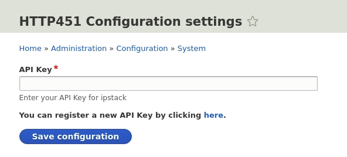

# RFC7725 HTTP451 Drupal Module

The HTTP451 module provides an implementation of [RFC 7725](https://tools.ietf.org/html/rfc7725) in Drupal. When enabled, it can be configured to modify the http response code of any resource served by Drupal and have a http 451 response code served instead of the original one. 

## Installation
* Download the module. [[Click here for latest version]](https://github.com/VEEGISHx/http451/archive/master.zip)

* Install it as you normally would by going to **`Extend > Install new module > upload`** or by extracting the contents of the zip file to your **`drupal/modules`** folder and activating it via your drupal admin dashboard.

* After activating the module you will need to provide an API Key for location-based censorship. You can get one [here](https://ipstack.com/product).

* Add your API key to the module configuration by navigating to **`Configuration > http451 Settings`** and paste your key in the form provided.

* Once the API Key set click on **`Structure > Content types`** and click on **`Manage Fields`** for the content type on which you want the module to be used.

* Click on **`Add field`** & select **`HTTP 451 Status Code`** from the **`Select a field type`** dropdown list. Give it a label and hit save. On the next page you'll be able to configure some default settings then you'll be good to go.

## Screenshots
### HTTP451 Configuration settings

### HTTP451 Custom Field

### Result of enabling the module on a node

## Maintainers
* [MaskyS](https://github.com/MaskyS)
* [VEEGISHx](https://github.com/VEEGISHx) 
