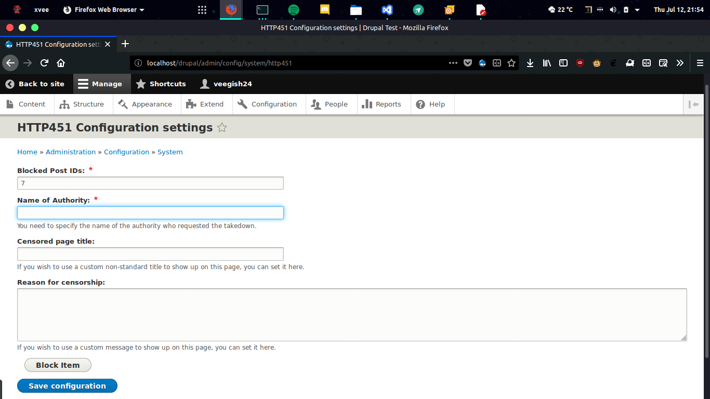

# HTTP541 Drupal Module

This is a basic implementation of [RFC 7725](https://tools.ietf.org/html/rfc7725) as a Drupal Module. 

## Installation
* Upload plugin directory to /modules/custom/ directory of your Drupal installation.

* Make sure the directory `src/Form` is writtable

* Activate the plugin on your browser through the 'Extend' service in menu.

## Usage
* Go to `configuration->System->http451 Settings` and fill in the form to block a post and return a HTTP 451 status

