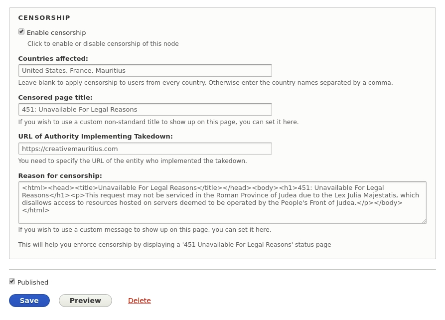
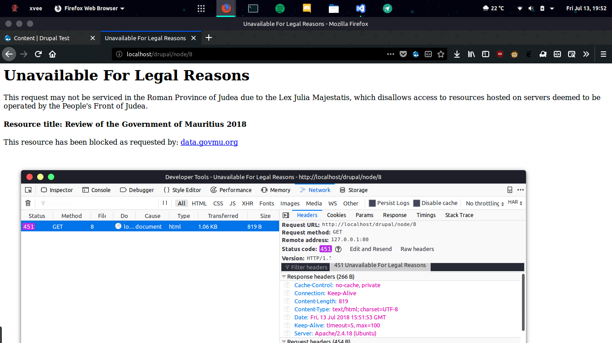

# RFC7725 HTTP541 Drupal Module

This is a basic implementation of [RFC 7725](https://tools.ietf.org/html/rfc7725) as a Drupal Module. 

## Installation
* Download the module. [[Click here for latest version]](https://github.com/VEEGISHx/http451/archive/master.zip)

* Go to **`Manage > Extend, and click on Install new module`**.

* Upload the downloaded zip file and click install.

* Once installed click on **`Structure > Content types`** and click on **`Manage Fields`** for the content type on which you want the module to be used.

* Click on **`Add field`** & select **`HTTP 451 Status Code`** from the **`Select a field type`** dropdown list. Give it a label and hit save. On the next page you'll be able to configure some default settings then you'll be good to go.

## Screenshots
### HTTP451 Custom Field

### Result of enabling the module on a node

## Maintainers
* [MaskyS](https://github.com/MaskyS)
* [VEEGISHx](https://github.com/VEEGISHx) 
